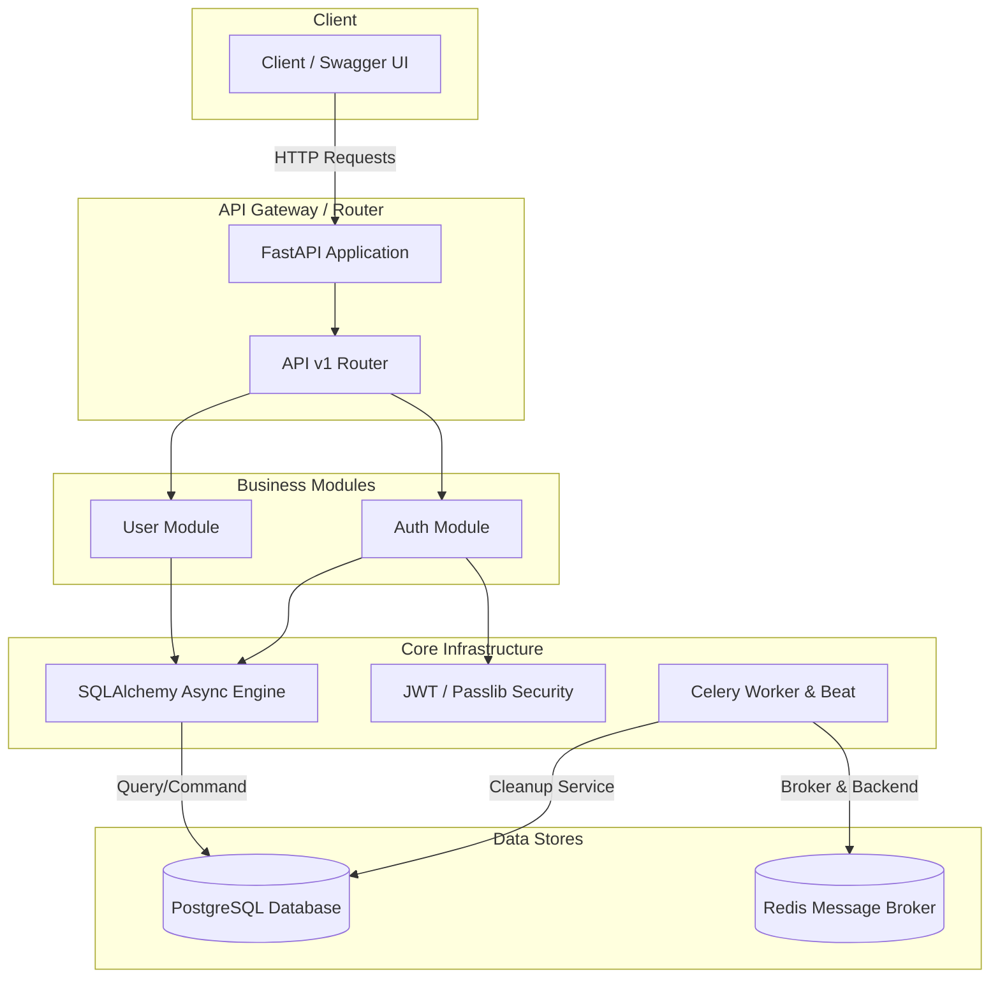

# Users API - User Management Module

A production-ready, extensible, and modular monolith user management system built with **FastAPI**, **SQLAlchemy (Async)**, **PostgreSQL**, **Redis**, and **Celery**.

This project provides a comprehensive user lifecycle management service, including registration, authentication/authorization via JWT, email verification, periodic tasks for unverified user cleanups, and role-based access control (RBAC).

---

## Architecture Design

The application utilizes a **Modular Monolith** architecture pattern. It is structured into business modules (`auth` and `user`), which isolate domain models, database logic, schemas, and API routers. This ensures that the codebase can scale cleanly and be easily separated into microservices if needed.



### Module Breakdown
*   **`core`**: Contains settings management (Pydantic Settings), database session hooks, security configurations (JWT tokens & password hashing), global exception handlers, and Celery scheduler parameters.
*   **`auth`**: Handles authentication workflows: signup validation, user login, token refresh, account verification checks, and centralized dependency providers (`get_user_service`, `get_auth_service`).
*   **`user`**: Exposes user-specific operations, pagination list queries, ID lookups, partial data updates, role promotion/demotion, and deletions.

---

## Features

1.  **Registration**: Sign up with an email and password. Users are initialized as unverified.
2.  **JWT Authentication**: Login yields both `access_token` and `refresh_token`. Refreshing access tokens prevents users from having to re-authenticate frequently.
3.  **Verification Flow**: Validates the 6-digit confirmation code. In development, this code is output directly to the container/application stdout logs.
4.  **Automatic Cleanup**: Active Celery Beat task runs hourly to purge unverified accounts created more than 2 days ago.
5.  **Role-Based Access Control**: Exposes `User` and `Admin` roles. Restricts admin endpoints (e.g. user listing, specific lookups, and account deletions) to admin users.
6.  **Role Promotion & Demotion**: Dedicated endpoints to promote a user to Admin or demote them back to User — open for development/testing convenience.
7.  **Global Exception Handling**: Centralized error handling (`core/exception_handlers.py`) catches database integrity errors, validation errors, and unhandled exceptions, returning consistent JSON error responses.

---

## Project Structure

```text
├── docker-compose.yml       # Production/development services orchestrator
├── justfile                 # Commands shortcut script
├── README.md                # Documentation and setup instructions
├── scripts
│   └── init_env.sh          # Auto-generates .env with secure JWT_SECRET_KEY
└── server
    ├── Dockerfile           # Python 3.13 docker image configuration
    ├── pytest.ini           # Pytest configuration (asyncio mode)
    ├── requirements.txt     # Python packages and version requirements
    ├── app
    │   ├── api              # Global API Routing structure
    │   │   ├── debug        # Debug-only routes (enabled when DEBUG=true)
    │   │   │   ├── __init__.py
    │   │   │   └── router.py
    │   │   └── v1
    │   │       ├── __init__.py
    │   │       └── router.py
    │   ├── auth             # Auth domain logic
    │   │   ├── __init__.py
    │   │   ├── dependencies.py
    │   │   ├── router.py
    │   │   ├── schemas.py
    │   │   └── service.py
    │   ├── core             # Global shared configuration & settings
    │   │   ├── config.py
    │   │   ├── database.py
    │   │   ├── exception_handlers.py
    │   │   └── security.py
    │   ├── user             # User domain logic
    │   │   ├── __init__.py
    │   │   ├── models.py
    │   │   ├── router.py
    │   │   ├── schemas.py
    │   │   └── service.py
    │   ├── logging_config.py # Unified color-coded logging utility
    │   ├── main.py          # FastAPI application initialization & DB seeding
    │   ├── tasks.py         # Celery background tasks
    │   └── worker.py        # Celery application configuration & scheduling
    └── tests                # Pytest integration/unit test suite
        ├── __init__.py
        ├── conftest.py
        └── test_auth.py
```

---

## Setup & Execution

> [!WARNING]
> **Strictly Containerized Execution Required**
> This application is designed to run **exclusively** inside the Docker Compose environment. Running the application directly on the host machine (locally) is **not supported** to avoid platform-specific dependency collisions (such as Python 3.13 differences, Postgres compiler adapter issues, and local Redis/Celery queue mismatches). All development, runs, and testing are orchestrated via Docker.

### Requirements
* **Docker** (required)
* **just** (optional — a command runner for convenience shortcuts. If not installed, use the equivalent Docker commands shown below)

### Environment Configuration
The project isolates configuration from runtime environments using a `.env` file (which is added to `.gitignore` to prevent secret leakage):

1. **Setup & Initialization**: Run `just setup` (or manually run `./scripts/init_env.sh`). The script will detect if a `.env` file is missing, copy the template `.env.example`, and generate a cryptographically secure 256-bit `JWT_SECRET_KEY` using `openssl`.
2. **Production Environments**: In production, do not deploy the `.env` file. Environment variables should be injected directly into the execution space (e.g., via GitHub Actions Secrets, AWS Secrets Manager, or HashiCorp Vault).

### Start the Application
Build and launch all containers (FastAPI, PostgreSQL, Redis, Celery Worker, and Celery Beat):

```bash
just start
# or manually:
# ./scripts/init_env.sh   (if .env doesn't exist yet)
# docker compose up --build
```

*   **FastAPI Application**: Accessible at [http://localhost:8000](http://localhost:8000)
*   **Swagger API Docs**: Accessible at [http://localhost:8000/docs](http://localhost:8000/docs)
*   **Redoc**: Accessible at [http://localhost:8000/redoc](http://localhost:8000/redoc)

### Default Admin Account
For convenience during development and API review, an Admin user is automatically seeded on startup:
*   **Email**: `admin@example.com`
*   **Password**: `adminpassword`

### Running Tests

```bash
just test
# or manually:
# docker compose run --rm -v ./server/tests:/app/tests app pytest -o asyncio_mode=auto -o asyncio_default_fixture_loop_scope=function /app/tests
```

### Stopping the Services
To stop and clean container volumes, run:

```bash
just stop
# or manually:
# docker compose down -v
```

---

## Verification & Automatic Cleanup

### 1. Account Verification Flow
* **Sign Up**: When a new user registers via `POST /auth/signup`, their account status starts as `is_verified = False`, and a secure 6-digit confirmation code is generated and saved with an expiration time of 24 hours.
* **Delivery**: In the development environment, the verification code is printed directly to the container's standard output (console log) to mock an email/SMS transmission.
* **Developer Convenience**: For ease of testing from the Swagger UI, the generated verification code is also returned in the JSON response payload of `POST /auth/signup`. Once the account is successfully verified, this value is cleared and returns as `null`.
* **Verification**: The user submits the code to `POST /auth/verify`. If the code is correct and not expired, the account status is updated to `is_verified = True`.

### 2. Automatic Cleanup of Unverified Users (Celery Beat)
* **Rule**: Users who do not verify their account within **2 days** of registration are automatically purged from the database.
* **Implementation**: A Celery background worker manages this cleanup through a scheduled task:
  * **Task**: `cleanup_unverified_users` in `app/tasks.py`.
  * **Schedule**: Configured in `app/worker.py` to run automatically **once every hour** via Celery Beat scheduler.
* **Unit Testing (Immediate Verification)**:
  * Because waiting 2 days is impractical during testing, the unit test (`test_unverified_users_cleanup` in `tests/test_auth.py`) bypasses the delay.
  * It inserts an unverified user record with a `created_at` timestamp manually backdated by 3 days, executes the cleanup function with the testing database session, and verifies that the old unverified user is immediately and correctly purged while recent unverified users are left untouched.

---

## Logging Architecture
The application uses a unified, custom color-coded logging utility (`app/logging_config.py`):
* **Format**: Standardized log format across the app: `%(asctime)s - %(name)s - %(levelname)s - %(message)s (%(filename)s:%(lineno)d)`
* **ANSI Color Scheme**: Output is dynamically colorized based on severity level (e.g., info logs are magenta, warnings are yellow, errors are red) for readable terminal debugging.
* **Log Level**: Controlled dynamically via the `LOG_LEVEL` environment variable.

---

## Detailed Endpoint Documentation

### Standard Routes
| Method | Endpoint | Access Level | Description |
| :--- | :--- | :--- | :--- |
| **POST** | `/auth/signup` | Public | Register a new user profile. Outputs verification code to logs. |
| **POST** | `/auth/login` | Public | Obtain an Access JWT and a Refresh JWT. |
| **POST** | `/auth/refresh` | Public | Refresh the Access token with a Refresh token. |
| **POST** | `/auth/verify` | Public | Input verification code to set user status to "verified". |
| **GET** | `/me` | Logged In | Get current authenticated user profile details. |
| **GET** | `/users` | Admin Only | Get paginated list of all users in the system. |
| **GET** | `/users/{id}` | Admin Only | Retrieve a user profile by their UUID. |
| **PATCH** | `/users/{id}` | Owner / Admin | Partially update user profile data (email, name, password). |
| **DELETE** | `/users/{id}` | Admin Only | Delete user profile from the database. |
| **POST** | `/users/{id}/promote` | Public (Dev) | Promote a user to Admin role. |
| **POST** | `/users/{id}/demote` | Public (Dev) | Demote an admin to standard User role. |

### Development & Debug Routes (Only available when `DEBUG=true`)
| Method | Endpoint | Access Level | Description |
| :--- | :--- | :--- | :--- |
| **GET** | `/debug/routes` | Public (Dev) | Lists all registered API routes, methods, and endpoints. |
| **GET** | `/debug/config` | Public (Dev) | Exposes non-sensitive settings (e.g. CORS, expiry parameters). |
| **GET** | `/debug/health` | Public (Dev) | Returns detailed health check with platform and Python engine metadata. |

---

## Simplification Decisions & Production Scaling Notes

If preparing for a true large-scale production release, we would build upon the current structure with the following:

1.  **Secret Management**:
    *   *Current*: The local build environment generates a secure `.env` on demand.
    *   *Production*: Enforce HTTPS/SSL, disable Swagger UI in production domains, and supply sensitive credentials (JWT keys, DB credentials) using secure Docker Secrets or runtime secret providers.
2.  **Email & SMS Delivery**:
    *   *Current*: Log verification codes to the console stdout.
    *   *Production*: Integrate with a real transactional mail/SMS provider (e.g. SendGrid, Mailgun, Amazon SES, Twilio) inside `auth/service.py` to transmit actual codes/activation links to users.
3.  **Database Migration System**:
    *   *Current*: Schema tables are dynamically created at startup using SQLAlchemy's metadata.
    *   *Production*: Implement **Alembic** migration tracking to handle changes to database structures incrementally and avoid data loss.
4.  **Token Expiry & Revocation (Blacklisting)**:
    *   *Current*: Token verification rely on standard JWT payload expiration metadata.
    *   *Production*: Store blacklisted JWTs (e.g. when logging out) or active session descriptors in Redis to support immediate token invalidation before they expire naturally.
5.  **Celery Beat Robustness**:
    *   *Current*: Celery worker runs with a simple thread-safe wrapper loop calling async code.
    *   *Production*: Run task scheduler events to trigger dedicated API actions via HTTP webhooks, or configure tortoise-orm/beanie/SQLAlchemy with dedicated connection pools for background processes to prevent session overlap errors under heavy workloads.
6.  **3-Layer Architecture (Router -> Service -> Repository)**:
    *   *Current*: The codebase uses a 2-layer structure where Routers invoke class-based Service instances (injected via centralized dependency providers), and Services execute SQLAlchemy queries directly.
    *   *Production*: For larger projects, we would add a dedicated Repository layer (Router -> Service -> Repository) to completely abstract the database access layer, simplify unit testing/mocking, and isolate domain business logic from specific persistence frameworks.

